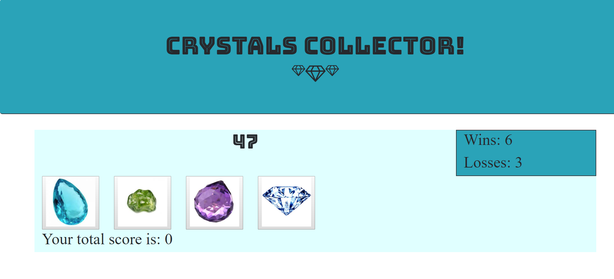

# crystals-collector

To play this game, the user must click on the crystal images to try to add up their sum to equal the generated random number that is displayed.  The crystals hide random numbers that are generated each new game.  The game keeps track of the user's wins and losses, updating after each game.

Deployed project: https://bethgrogg.github.io/crystals-collector/